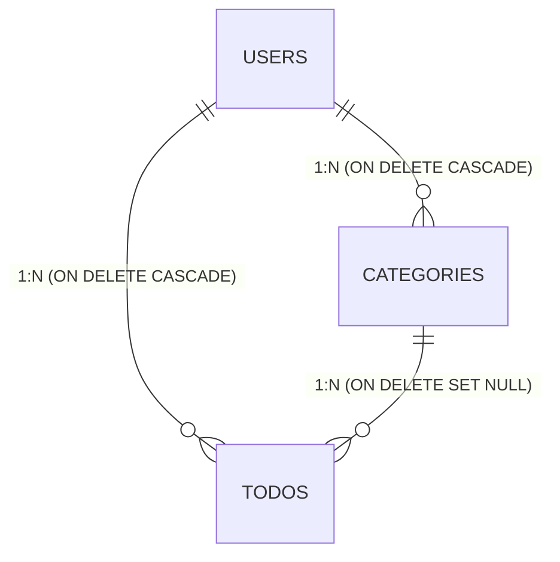

## 各テーブルの定義

### User テーブル

| カラム名        | 型            | 制約                         | 説明                     |
|-----------------|---------------|------------------------------|--------------------------|
| id              | UUID          | PRIMARY KEY                  | ユーザーの一意なID       |
| email           | VARCHAR(255)  | NOT NULL, UNIQUE             | メールアドレス           |
| password_hash   | VARCHAR(255)  | NOT NULL                     | ハッシュ化されたパスワード |
| deleted_at      | DATETIME      | NULL OK      | 削除日時                |

ポイント:

- id はユーザーにアカウント総数を推測させないためにUUIDにする。
- Userテーブルをきれいにするため、emailにはユニーク制約を設ける。
- 論理削除とする。

### Category テーブル

| カラム名        | 型            | 制約                         | 説明                     |
|-----------------|---------------|------------------------------|--------------------------|
| id              | UUID          | PRIMARY KEY                  | カテゴリの一意なID        |
| user_id         | UUID          | NOT NULL, FOREIGN KEY        | ユーザID（外部キー）      |
| name            | VARCHAR(100)  | NOT NULL                     | カテゴリ名               |
| color           | VARCHAR(20)   | NOT NULL                     | カテゴリーの色（#RRGGBB形式）|
| deleted_at      | DATETIME      | NULL OK      | 削除日時                |

制約:

- UNIQUE(user_id, name)  ← 同じユーザー内でカテゴリ名が重複しないようにする

ポイント:

- user_idは外部キー制約が必要（usersテーブルのidを参照）
- ユーザーが削除されたら、そのカテゴリーも削除する（CASCADE削除）
- 同じユーザーが同じ名前のカテゴリを複数作れない（UNIQUE制約）

### Todo テーブル

| カラム名        | 型            | 制約                         | 説明                     |
|-----------------|---------------|------------------------------|--------------------------|
| id              | UUID          | PRIMARY KEY                  | Todoの一意なID           |
| user_id         | UUID          | NOT NULL, FOREIGN KEY        | ユーザID（外部キー）      |
| category_id     | UUID          | FOREIGN KEY, NULL OK         | カテゴリーID（外部キー、NULLも許可）|
| title           | VARCHAR(255)  | NOT NULL                     | Todoのタイトル           |
| description     | TEXT          | NULL OK                      | Todoの詳細説明           |
| due_date        | DATE          | NULL OK                    | Todoの期限日             |
| priority        | INT          | NOT NULL, DEFAULT 3           | Todoの優先度（1-5の整数）  |
| is_completed    | BOOLEAN       | NOT NULL, DEFAULT FALSE      | Todoの完了の有無          |
| deleted_at      | DATETIME      | NULL OK      | 削除日時                |

ポイント:

- category_idはNULLを許可する（カテゴリーなしのTodoも可能）
- priorityは数値（INTEGER）、`NOT NULL, DEFAULT 3`でソートしやすくする
- カテゴリーが削除されたら、そのTodoのcategory_idをNULLにする

## リレーション（外部キー制約）の定義

外部キー制約:

1. categories.user_id → users.id: ON DELETE CASCADE（ユーザー削除時、カテゴリーも削除）
2. todos.user_id → users.id: ON DELETE CASCADE（ユーザー削除時、Todoも削除）
3. todos.category_id → categories.id: ON DELETE SET NULL（カテゴリー削除時、category_idをNULLに設定）

ただし、論理削除（is_deleted=true）を使う場合、実際には物理的なDELETEは実行されません。

なので：

- ON DELETE CASCADEは動作しない
- 代わりに、アプリケーション層で論理削除の処理を実装する必要がある

例: ユーザーを論理削除する時

1. users.is_deleted = true にする
2. 同時に、そのユーザーのcategories.is_deleted = trueにする
3. そのユーザーのtodos.is_deleted = trueにする

これはSpring Bootのサービス層で実装します。

## インデックスの設計

検索が多いカラムにインデックスを作成:

- users テーブル: email にユニークインデックス（ログイン時の検索）
- categories テーブル: user_id にインデックス（ユーザーのカテゴリー一覧取得）
- todos テーブル: user_id にインデックス（ユーザーのTodo一覧取得）

考えるポイント:

- インデックスは検索を高速化するが、書き込みは少し遅くなる
- どのカラムによく検索条件を指定するか？

## ER図

## 正規化の確認

- 第1正規形: すべてのカラムがアトミック（1つの値）か？ ✅
- 第2正規形: 主キーに完全関数従属しているか？ ✅
- 第3正規形: 推移的関数従属がないか？ ✅

→ 今回の設計は第3正規形まで満たしている
