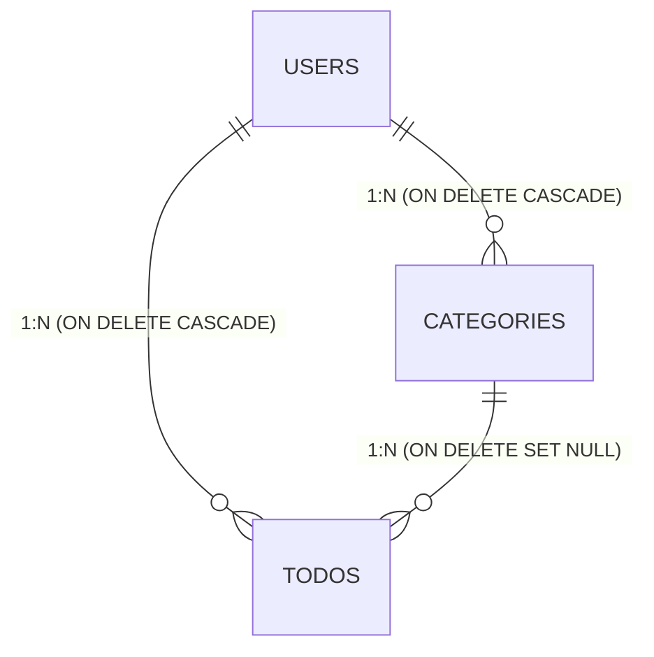

# 作業ログ: 2026-01-13 (データベース設計編)

## 学習情報

- **日付**: 2026-01-13
- **学習フェーズ**: WBS 1.1 設計フェーズ - データベース設計
- **学習時間**: 約1時間
- **ステータス**: データベース設計（table_definitions.md）完成

---

## 完了したタスク

### 作成したドキュメント

- **ファイル名**: `docs/01_specs/database/table_definitions.md`
- **目的**: PostgreSQLのテーブル定義とリレーション設計

---

## データベース設計の概要

### Phase 1で実装するテーブル（3つ）

1. User（ユーザー）
2. Category（カテゴリー）
3. Todo（タスク）

※ TimeEntry、Tag、TodoTagはPhase 2以降で実装

---

## 各テーブルの設計詳細

### 1. Userテーブル

**目的**: ユーザー情報を管理

| カラム名 | 型 | 制約 | 説明 |
|---------|---|------|------|
| id | UUID | PRIMARY KEY | ユーザーの一意なID |
| email | VARCHAR(255) | NOT NULL, UNIQUE | メールアドレス |
| password_hash | VARCHAR(255) | NOT NULL | ハッシュ化されたパスワード |
| deleted_at | DATETIME | NULL OK | 削除日時（論理削除） |

**設計のポイント:**
- **UUIDを使用**: 連番IDではユーザー数が推測されるため
- **ユニーク制約**: 同じメールアドレスで複数アカウント作成を防止
- **論理削除**: 物理削除ではなく`deleted_at`に日時を設定

---

### 2. Categoryテーブル

**目的**: Todoを分類するカテゴリーを管理

| カラム名 | 型 | 制約 | 説明 |
|---------|---|------|------|
| id | UUID | PRIMARY KEY | カテゴリーの一意なID |
| user_id | UUID | NOT NULL, FOREIGN KEY | ユーザーID（外部キー） |
| name | VARCHAR(100) | NOT NULL | カテゴリー名 |
| color | VARCHAR(20) | NOT NULL | カテゴリーの色（#RRGGBB形式） |
| deleted_at | DATETIME | NULL OK | 削除日時（論理削除） |

**制約:**
- UNIQUE(user_id, name) ← 同じユーザー内でカテゴリー名が重複しないようにする

**設計のポイント:**
- **user_idは外部キー**: usersテーブルのidを参照
- **複合ユニーク制約**: 同じユーザーが同じ名前のカテゴリーを複数作れない
- **色の保存**: UIで視覚的に区別しやすくするため

---

### 3. Todoテーブル

**目的**: タスク情報を管理

| カラム名 | 型 | 制約 | 説明 |
|---------|---|------|------|
| id | UUID | PRIMARY KEY | Todoの一意なID |
| user_id | UUID | NOT NULL, FOREIGN KEY | ユーザーID（外部キー） |
| category_id | UUID | FOREIGN KEY, NULL OK | カテゴリーID（外部キー、NULLも許可） |
| title | VARCHAR(255) | NOT NULL | Todoのタイトル |
| description | TEXT | NULL OK | Todoの詳細説明 |
| due_date | DATE | NULL OK | Todoの期限日 |
| priority | INT | NOT NULL, DEFAULT 3 | Todoの優先度（1-5の整数） |
| is_completed | BOOLEAN | NOT NULL, DEFAULT FALSE | Todoの完了の有無 |
| deleted_at | DATETIME | NULL OK | 削除日時（論理削除） |

**設計のポイント:**
- **category_idはNULL許可**: カテゴリーなしのTodoも可能
- **priorityは数値**: ソートしやすい、フィルタしやすい
  - 1: 最低
  - 2: 低
  - 3: 中（デフォルト）
  - 4: 高
  - 5: 最高
- **descriptionはTEXT型**: 長い文章も入力可能

---

## リレーション（外部キー制約）

### 外部キー制約の定義

1. **categories.user_id → users.id**
   - ON DELETE CASCADE（ユーザー削除時、カテゴリーも削除）

2. **todos.user_id → users.id**
   - ON DELETE CASCADE（ユーザー削除時、Todoも削除）

3. **todos.category_id → categories.id**
   - ON DELETE SET NULL（カテゴリー削除時、category_idをNULLに設定）

### 論理削除を使う場合の注意点

**重要**: 論理削除（deleted_at）を使う場合、物理的なDELETEは実行されません。

**影響:**
- ON DELETE CASCADEは動作しない
- 代わりに、アプリケーション層で論理削除の処理を実装する必要がある

**例: ユーザーを論理削除する時**
1. users.deleted_at = 現在日時 にする
2. 同時に、そのユーザーのcategories.deleted_at = 現在日時 にする
3. そのユーザーのtodos.deleted_at = 現在日時 にする

これはSpring Bootのサービス層で実装します。

---

## インデックス設計

### 作成するインデックス

検索が多いカラムにインデックスを作成：

1. **usersテーブル**
   - `email` にユニークインデックス（ログイン時の検索）

2. **categoriesテーブル**
   - `user_id` にインデックス（ユーザーのカテゴリー一覧取得）

3. **todosテーブル**
   - `user_id` にインデックス（ユーザーのTodo一覧取得）

### インデックスの考え方

**メリット:**
- 検索を高速化

**デメリット:**
- 書き込みが少し遅くなる
- ストレージを消費する

**判断基準:**
- どのカラムによく検索条件を指定するか？
- WHERE句、JOIN、ORDER BYでよく使うカラム

---

## ER図

**リレーションの説明:**
- 1人のユーザーは複数のカテゴリーを持つ（1:N）
- 1人のユーザーは複数のTodoを持つ（1:N）
- 1つのカテゴリーは複数のTodoに紐づく（1:N）
- 1つのTodoは1つのカテゴリーに紐づく（または紐づかない）

---

## 正規化の確認

### 第1正規形（1NF）

**定義**: すべてのカラムがアトミック（1つの値）か？

**確認結果**: ✅ すべてのカラムは単一の値

### 第2正規形（2NF）

**定義**: 主キーに完全関数従属しているか？

**確認結果**: ✅ 各テーブルは単一の主キー（id）を持ち、すべてのカラムはidに従属

### 第3正規形（3NF）

**定義**: 推移的関数従属がないか？

**確認結果**: ✅ 非キー属性間の従属関係がない

**結論**: 今回の設計は第3正規形まで満たしている

---

## 学んだ重要な概念

### 1. UUIDの利点

**連番ID（AUTO_INCREMENT）の問題点:**
- ユーザー数やデータ総数が推測される
- マージやレプリケーションで衝突する可能性

**UUIDの利点:**
- グローバルで一意
- 推測不可能
- 分散システムに適している

**UUIDのデメリット:**
- 連番より大きい（16バイト）
- ソートが難しい（作成順にならない）

**判断**: 今回はセキュリティとスケーラビリティを優先してUUID採用

---

### 2. 論理削除 vs 物理削除

**物理削除:**
- データを完全に削除（DELETE文）
- ストレージ節約
- 復元不可能

**論理削除:**
- deleted_atフラグを設定
- データは残る
- 復元可能
- 監査ログとして使える

**判断**: 今回は論理削除を採用
- 理由: 削除したデータを後で確認できる、復元可能、監査に有利

---

### 3. 外部キー制約の重要性

**外部キー制約の役割:**
- データの整合性を保証
- 存在しないデータへの参照を防ぐ

**例:**
- todos.category_id に存在しないカテゴリーIDが入るのを防ぐ
- データベースレベルで整合性を保証

---

### 4. インデックスの設計

**インデックスを作るべき場所:**
- WHERE句で頻繁に使うカラム
- JOIN条件で使うカラム
- ORDER BYで使うカラム

**インデックスを作らない方が良い場所:**
- 書き込みが多いテーブル
- カーディナリティが低いカラム（例: boolean）
- めったに検索しないカラム

---

### 5. 正規化の重要性

**正規化のメリット:**
- データの冗長性を排除
- 更新異常を防ぐ
- データの整合性を保つ

**正規化のデメリット:**
- JOINが増える
- クエリが複雑になる

**判断基準:**
- トランザクション系（書き込みが多い）: 正規化を優先
- 分析系（読み込みが多い）: 非正規化も検討

今回はトランザクション系なので第3正規形まで正規化。

---

## 設計で工夫したポイント

### 1. Phase 1に絞った設計

**含めなかったもの:**
- created_at, updated_at（必要になったら追加）
- completed_at（Phase 2で追加予定）
- estimated_time（Phase 2で追加予定）
- parent_todo_id（サブタスク、Phase 3で追加予定）

**理由:**
- YAGNI原則（You Aren't Gonna Need It）
- 最初はシンプルに
- 必要になったらマイグレーションで追加できる

### 2. 柔軟性を持たせた設計

**category_idをNULL許可:**
- カテゴリーなしのTodoも作成可能
- ユーザーの自由度を高める

**priorityをINT型:**
- 文字列（HIGH/MEDIUM/LOW）ではなく数値
- ソート、フィルタが容易
- 将来的に段階を増やせる（例: 1-10）

### 3. ユーザー単位のデータ分離

**すべてのテーブルにuser_idを含める:**
- マルチユーザー対応
- ユーザーごとにデータを分離
- セキュリティ向上（他のユーザーのデータにアクセスできない）

---

## 発生した課題と解決

### 課題1: priorityの型をEnumにするかINTにするか

**検討内容:**
- Enum（HIGH, MEDIUM, LOW）: 意味が明確
- INT（1-5）: ソート・フィルタが容易

**解決:**
- INT型を採用
- 理由: APIで配列フィルタ `"priority": [3,4,5]` が使いやすい

### 課題2: 論理削除か物理削除か

**検討内容:**
- 物理削除: シンプル、ストレージ節約
- 論理削除: 復元可能、監査に有利

**解決:**
- 論理削除（deleted_at）を採用
- 理由: 後で確認・復元できる、学習目的として適切

### 課題3: created_at, updated_atを含めるか

**検討内容:**
- 含める: 将来便利、監査に使える
- 含めない: シンプル、YAGNI原則

**解決:**
- Phase 1では含めない
- 理由: 必要になったら追加できる

---

## 次のステップ

データベース設計が完了したので、次は以下を実施：

1. **API設計**
   - エンドポイント定義
   - リクエスト・レスポンススキーマ
   - エラーレスポンス定義

2. **ワイヤーフレーム作成**
   - 各画面のレイアウト設計

---

## まとめ

データベース設計を通じて、データモデルの詳細が明確になりました。

**達成したこと:**
- ✅ 3つのテーブル定義（User, Category, Todo）
- ✅ リレーション定義（外部キー制約）
- ✅ インデックス設計
- ✅ ER図作成
- ✅ 正規化の確認（第3正規形）

**学んだこと:**
- UUIDの利点とデメリット
- 論理削除 vs 物理削除
- 外部キー制約の重要性
- インデックス設計の考え方
- 正規化の重要性

**設計の原則:**
- YAGNI原則に従ってシンプルに
- 将来の拡張を見据えた柔軟な設計
- ユーザー単位のデータ分離

---

**作成日**: 2026-01-13
**WBS進捗**: 1.1 設計フェーズ - データベース設計 完了
